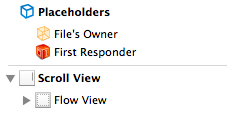

ETFlowView
========
Automatic layout every single subview when the frame of a view in the hierarchy is changed.

If you are a web or Android developer, imagine this as what is. You just write the code and the elements fit where they need to be.

Installation
--------
Clone this repo and copy the folder **ETFlowView** into your Xcode project.

How-to
--------

ETFlowView can be user both programmatically or loaded automatically from a nib.

If you are going to load it from a nib, just load a standard `UIView` from the elements panel and change its class to `ETFlowView`:

		
If you wish to use a subclass of `UIView`, such as `UIScrollView` or `UITableView`, just add `ETFlowView` view inside them as a subview.

If you need to reference it on code, just make an IBOutlet out of it:

Programmatically, just alloc it normally and set its frame:

All elements will be automatically bound whenever you call `addSubView` or `removeFromSuperview`.

Support
--------
Just open an issue on Github and we'll get to it as soon as possible.

About
--------
ETFlowView is brought to you by Estúdio Trilha.
