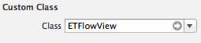
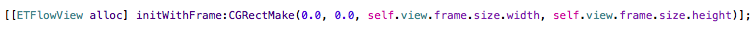

ETFlowView
========
It's simple. You have many many views inside your controller. You change the frame of one of them. You breath. And then you have to manually update every single frame on the hierarchy to fill the missing gap.

**ETFlowView** is an automatic layout engine, so every single subview will be updated when the frame of a view in the hierarchy is changed.

If you are a web or Android developer, you must be surprised that this project even exists, since Apple should have implemented it many many years ago.

One element after the other. You just write the code and the elements fit where they need to be.

Installation
--------
Clone this repo and copy the folder **ETFlowView** into your Xcode project.

How-to
--------

**ETFlowView** can be user both programmatically or loaded automatically from a nib.

### Nib

If you are going to load it from a nib, just load a standard `UIScrollView` from the elements panel and change its class to `ETFlowView`:

If you need to reference it on code, just make an IBOutlet out of it:

### Programmatically

Programmatically, just alloc it and set its frame:

All elements will be automatically bound whenever you call `addSubView` or `removeFromSuperview`.

### Trigger

To trigger the update the update on the view's structure, you have to **manually** update the target frame. Do not use `sizeToFit`, since it will end up updating the inner views of public classes.

Everytime a view is resized, `ETFlowView` will update its `contentSize` property to perfectly fit the content.

Support
--------
Just open an issue on Github and we'll get to it as soon as possible.

About
--------
**ETFlowView** is brought to you by Estúdio Trilha.
